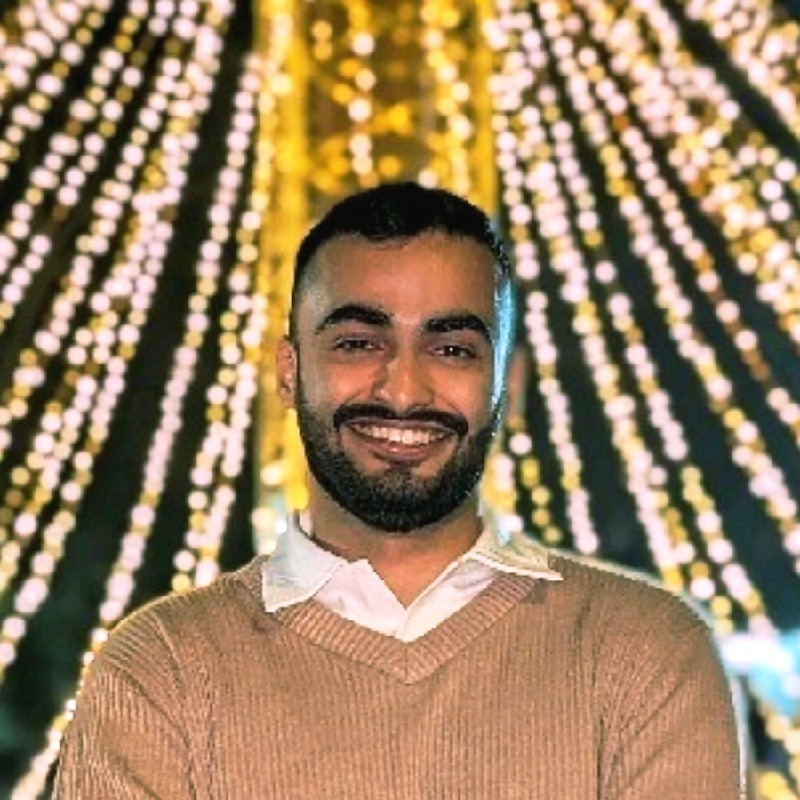
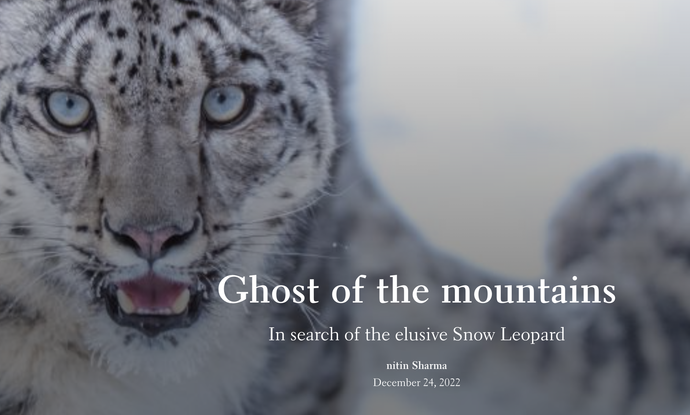
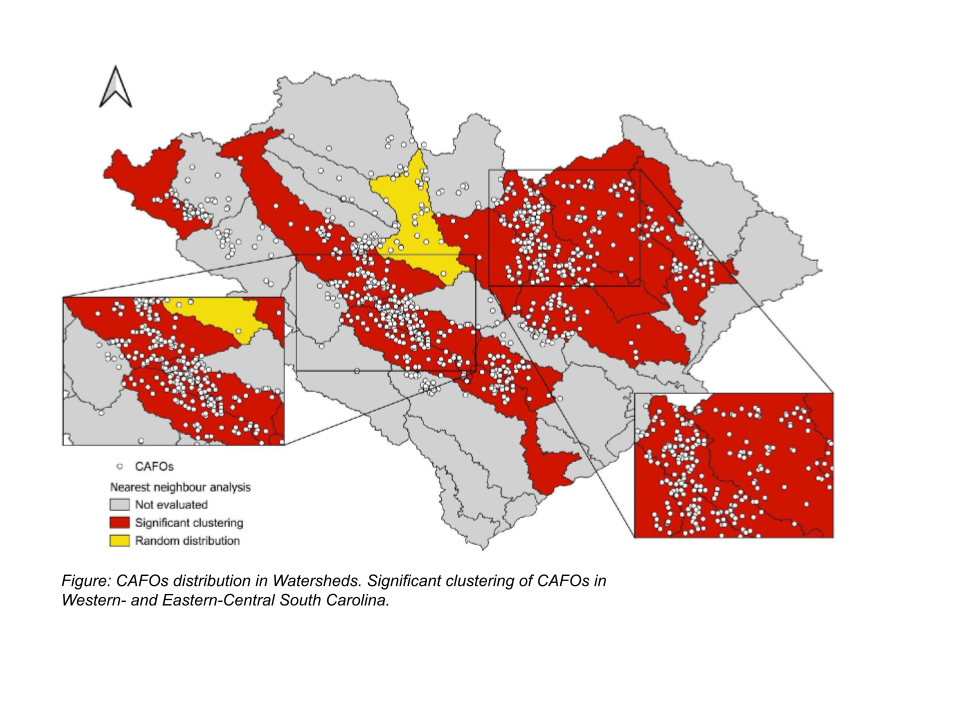
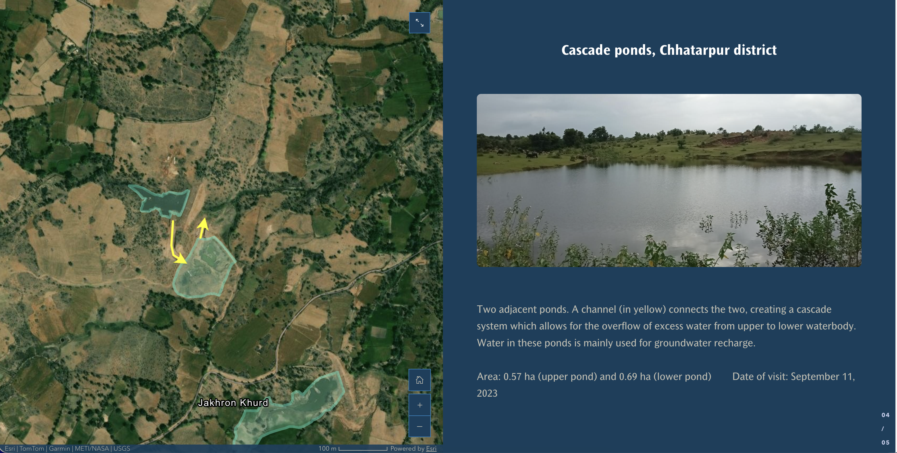

---
hide:
  - home
  - toc
  - navigation
---
<!--
CHECKLIST FOR THIS PAGE:
- [ ] Replace [YOUR NAME] with your full name (3 places)
- [ ] Replace [YOUR JOB TITLE] with your current or target role
- [ ] Replace [YOUR TAGLINE] with a short phrase describing your focus
- [ ] Rewrite the About Me paragraph with your own words
- [ ] Replace assets/images/profile.png with your actual photo (keep the filename or update it below)
- [ ] Add a wide cover/banner image to assets/images/cover.png (roughly 1200x300px works well)
- [ ] Replace assets/images/about.png with your own image (a field photo, map, or workspace shot)
- [ ] Replace the two placeholder project cards with your real projects
- [ ] For each project: add a thumbnail image to docs/assets/images/ and update the path below
- [ ] For each project: create a project detail page by copying sample-project.md
- [ ] Edit the skill cards to match your actual skills (add, remove, or rename cards as needed)
- [ ] Update GitHub and LinkedIn links in the Connect section
- [ ] Add your CV PDF to docs/assets/ and update the filename in the Download CV button

NOTE ON THE TOP BAR:
The default MkDocs Material header AND tabs row are fully hidden site-wide (see .md-header,
.md-tabs in extra.css), so the page starts flush at the top with no reserved empty space.
.site-topbar below is the only header: name, tagline, then the Projects/Skills/Contact nav,
all stacked and centered, followed by the cover + profile photo.
-->

# Nitin Sharma { .visually-hidden }

  Nitin Sharma
  Turning spatial data into insights
  <nav class="home-nav">
    <a href="#projects">Projects</a>
    <a href="#skills">Skills</a>
    <a href="#contact">Contact</a>
    <a href="assets/Nitin_CV.pdf" >CV</a>
  </nav>

  

## About Me

I am a geospatial and policy analyst with sector experience in water management, climate risks, and agriculture. I have 3 years of total experience applying python and GIS skills in multiple projects- I have worked with Indian Institute of Technology, Delhi (Public policy) and International water management institute in consultant roles. I see my role as an anchor between technical skills and policy issues.

I am currently seeking opportunities in research roles and PhD positions with focus on applying geospatial analysis to water-climate-agriculture domains.

---

## Projects

A selection of my geospatial projects. Click any card to see the full write-up.

**[StoryMaps contest winner, 2022](projects/StoryMaps_contest.md)**

An ArcGIS StoryMap exploring the snow leopard — a mystical, elusive predator inhabiting the high-altitude regions of Northern and Central Asia across 12 countries — combining cartography, imagery, and narrative to raise awareness about the species and its habitat.

`ArcGIS StoryMaps` `ArcGIS Online`

[View Project →](projects/StoryMaps_contest.md){ .md-button }

**[Pollutant source mapping- USA](projects/ASU_Internship.md)**

Digitized and mapped Animal Feeding Operations (AFOs) across two states in the US, combined data extraction from databases and ground-truthing using ArcGIS Pro and QGIS workflows.

`QGIS` `ArcGIS` `Python` `ArcPy`

[View Project →](projects/ASU_Internship.md){ .md-button }

**[Water storage analysis- Bundelkhand](projects/Rainfall_dynamics.md)**

Assessed the impact of the 2023 monsoon rainfall deficit on surface water storage in the Ganga River Basin, building an integrated satellite-based framework in Google Earth Engine and establishing the first digital inventory of small water bodies in Bundelkhand, India.

`Google Earth Engine` `GIS` `ArcGIS StoryMaps`

[View Project →](projects/Rainfall_dynamics.md){ .md-button }

---

## Skills

**GIS & Remote Sensing**

:material-map:{ .lg } QGIS

:material-layers:{ .lg } ArcGIS Pro

:material-cloud:{ .lg } Google Earth Engine

**Programming**

:material-language-python:{ .lg } Python

:material-database:{ .lg } PostgreSQL + PostGIS

:material-code-braces:{ .lg } GeoPandas, Rasterio, NumPy

**Machine Learning & GeoAI**

:material-chart-timeline-variant:{ .lg } Supervised Classification (Random Forest)

:material-chart-scatter-plot:{ .lg } Unsupervised Classification (K-Means Clustering)

**Research**

:material-magnify:{ .lg } Research Gap Analysis

:material-scale-balance:{ .lg } Policy Analysis

---

## Contact

[GitHub](https://github.com/nitin18geo){ .md-button .contact-btn }
[LinkedIn](https://linkedin.com/in/nitingeology){ .md-button .contact-btn }
[Email](mailto:nitin18geo@gmail.com){ .md-button .contact-btn }