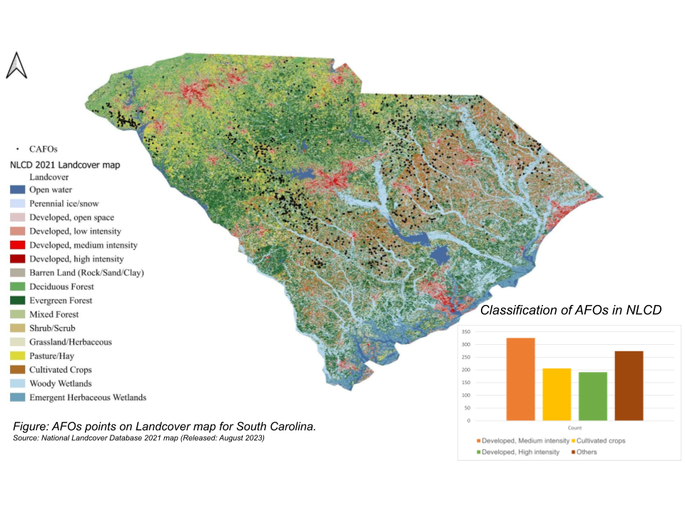

<!--
CHECKLIST FOR THIS PAGE (copy this file for each new project):
- [ ] Replace [YOUR PROJECT TITLE] with your project title
- [ ] Replace the hero image with your own (add to docs/assets/images/)
- [ ] Update the Overview section
- [ ] Update the Methods & Tools section
- [ ] Update the Key Findings section
- [ ] Update the Links section
- [ ] Add a card for this project on docs/projects/index.md
- [ ] Add a nav entry in mkdocs.yml
-->

# Digitization and mapping of phosphorous pollutant sources in a landscape

## Overview

Digitized and mapped phosphorous pollutant sources — Animal Feeding Operations (AFOs) — across the United States by ground-truthing existing datasets and generating a non-AFO comparison dataset, then analyzed their spatial patterns and land-cover classification to assess environmental and regulatory data gaps.

**Study Area:** United States (national scope), with focused analysis on South Carolina, and comparison across Louisiana, Ohio, and Wisconsin  
**Duration:** 2022 
**Role:** Internship
**Status:** Completed

---

## Methods & Tools

**Data Sources**

- AFO location data for Louisiana — National Agricultural Imagery Program (NAIP), classified using a CNN model and ArcGIS
- AFO location data for South Carolina — South Carolina Department of Health and Environmental Control (acquired 11/11/2019, University of Iowa)
- Non-AFO industry data — EZ Query on the EPA Facility Registry Service (FRS) website, filtered by NAICS code
- National Landcover Database (NLCD) 2021 Landcover map (released August 2023)

**Processing Steps**

1. Queried the FRS website using NAICS codes to identify non-AFO industry facilities, then exported and merged results using Python
2. Ground-truthed existing AFO datasets by importing CSVs into QGIS, exporting as shapefiles, and visually verifying each point against Google satellite imagery basemaps — snapping mislocated points to the nearest visible feature
3. Overlaid AFO point data on NLCD 2021 landcover classification to evaluate how well Hay/Pasture land cover serves as a proxy for AFO locations
4. Conducted nearest neighbor analysis on AFO locations within HUC8 watersheds to test for spatial clustering vs. random distribution

**Tools Used**

| Tool | Purpose |
|------|---------|
| QGIS | Ground-truthing and shapefile creation for AFO points |
| ArcGIS | AFO locations based L-Moran's I analysis |
| Python | Data export, merging, and processing of non-AFO industry data |

---
## Selected visuals
### Map of South Carolina & LULC:

### Nearest neighbour analysis for determining concentration of AFOs in watersheds of South Carolina:

---
## Key Findings

- Only **8.1%** of AFO locations in South Carolina fell within land classified as Hay/Pasture in the NLCD, showing that landcover-based proxies are unreliable for identifying AFO locations — consistent with observations in North Carolina
- South Carolina's AFO dataset was more complete than Louisiana's, including AFO type and animal count, making it the focus for deeper analysis
- Nearest neighbor analysis revealed significant clustering of AFOs in watersheds (HUC8) across Western and Eastern-Central South Carolina, highlighting a need for future environmental impact assessments in those watersheds
- Lack of standardized, complete AFO data across states impedes environmental impact studies, regulation, and policy-making

---
