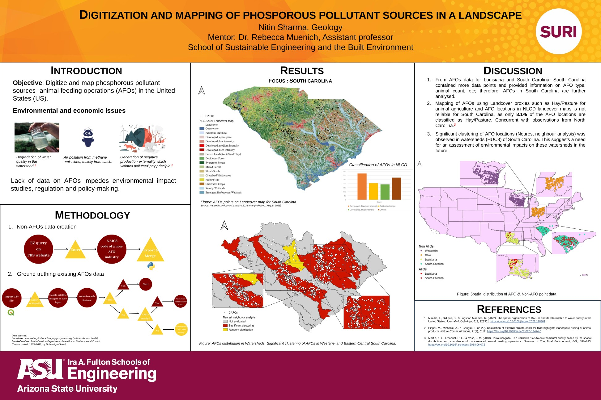

---
hide:
  - toc
  - navigation
---
<!--
CHECKLIST FOR THIS PAGE:
- [ ] Replace the two placeholder cards (marked [YOUR PROJECT ...]) with your real projects
- [ ] For each project: add a thumbnail image to docs/assets/images/ and update the path below
- [ ] For each project: create a project page by copying sample-project.md
- [ ] For each project: add a nav entry in mkdocs.yml (see the comments there)
- [ ] Delete placeholder cards you don't need yet
-->

# Projects

A selection of my geospatial projects. Click any card to see the full write-up.

**[StoryMaps: winner of ESRI India StoryMaps contest, 2022](StoryMaps_contest.md)**

An ArcGIS StoryMap exploring the snow leopard — a mystical, elusive predator inhabiting the high-altitude regions of Northern and Central Asia across 12 countries — combining cartography, imagery, and narrative to raise awareness about the species and its habitat.

`ArcGIS StoryMaps` `ArcGIS Online`

[View Project →](StoryMaps_contest.md){ .md-button }

**[Digitization and Mapping of Phosphorous Pollutant Sources](ASU_Internship.md)**

Digitized and mapped Animal Feeding Operations (AFOs)- across two states in the US, combined data extraction from databases and ground-truthing using ArcGIS pro and QGIS workflows.

`QGIS` `ArcGIS` `Python` `ArcPy`

[View Project →](ASU_Internship.md){ .md-button }

